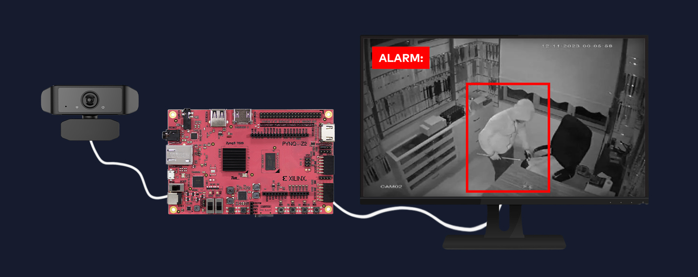

# FPGA-Based Real-Time Motion Detection & Object Tracking

## **FPGA | Embedded Systems | Image Processing**

Field-Programmable Gate Arrays (FPGAs) are widely utilized in image processing applications due to their reconfigurability and high computational capacity. The primary advantages of FPGA-based image processing include **low latency, high data processing speed, and hardware-level optimization of algorithms**.

FPGA-based systems excel in real-time applications, such as **medical imaging, video surveillance, and automotive vision systems**, where maximizing computational efficiency and minimizing latency are critical. By enabling algorithm-level parallelism, FPGAs can process multiple operations simultaneously, making them particularly well-suited for **video processing and complex image analysis**.

Common image processing techniques implemented on FPGAs include **image filtering, edge detection, histogram operations, and morphological transformations**. These methods are essential for **noise reduction, image sharpening, contrast enhancement**, and other preprocessing steps that improve the accuracy and reliability of image-based analysis.

### System Overview
The following diagram illustrates the overall architecture of the FPGA-based motion detection and tracking system.




For instance, **median filtering, Gaussian filtering, and wavelet-based noise reduction techniques** can be executed at high speed on FPGA-based systems due to their inherent parallel processing capabilities. This is particularly crucial for **enhancing image quality in low-light conditions or high-noise environments**, where traditional software-based approaches may struggle to deliver real-time performance.

The **FPGA architecture** consists of **Lookup Tables (LUTs), flip-flops, block RAM, and DSP slices**, all of which contribute to its ability to execute image processing algorithms in parallel. This architectural advantage allows FPGAs to **significantly enhance computational throughput**, making them more efficient than CPUs or GPUs, especially in applications involving **large datasets or computationally intensive operations**.

## **FPGA as a Hardware Accelerator**

FPGAs play a crucial role as **hardware accelerators** in software-intensive projects, offering significant advantages in computational performance. Their efficiency is particularly evident in applications involving **deep learning, machine learning, image processing, and large-scale data processing**. ([Run:ai](https://www.run.ai/guides/gpu-deep-learning/fpga-for-deep-learning))

The research community has adopted various **design methodologies** for implementing FPGA-based accelerators, including: ([MDPI](https://www.mdpi.com/2313-433X/5/1/16))

- **Custom hardware accelerators** developed in **HDL**, optimized for performance and area efficiency but requiring long development cycles.
- **Application-specific accelerators** built using **IP blocks**, allowing modular and efficient hardware designs.
- **High-Level Synthesis (HLS) tools**, such as **Xilinx Vivado HLS** and **Altera’s OpenCL compiler**, which translate C-based programs into **Register Transfer Level (RTL) designs**. These tools enable selective acceleration of software components, optimizing execution for parallel hardware operations.

In this project, **hardware acceleration is implemented on the Xilinx Vivado platform using IP blocks**, leveraging FPGA’s parallelism for enhanced computational efficiency.

The following section details the **application of FPGA as a hardware accelerator** within the project framework.

| Feature            | FPGA         | CPU        | GPU        |
|--------------------|-------------|------------|------------|
| Parallelism       | ✅ High      | ❌ Low     | ✅ Medium  |
| Latency          | ✅ Low       | ❌ High    | ✅ Medium  |
| Power Efficiency  | ✅ Efficient | ❌ High    | ❌ High    |


### **1. Algorithm Selection and FPGA Adaptation**

The first step involves selecting the **core image processing algorithms** to be implemented in the project, such as **edge detection, motion detection, and object tracking**. The final selection will be refined as the prototype is developed and tested. **FPGAs excel in handling such computationally intensive tasks due to their parallel processing capabilities**, allowing real-time execution of complex operations.

### **2. FPGA Design**

The FPGA implementation will leverage either **custom-designed or pre-existing IP blocks** to enable efficient memory access for image processing tasks. For instance, a **dedicated memory management module** can facilitate **preprocessing operations**, optimize data flow, and accelerate memory read/write operations, significantly improving system performance.

### **3. Data Management and Memory Optimization**

Image processing involves handling large volumes of data. Efficient utilization of **on-chip memory blocks (BRAM) and other FPGA resources** is critical to maintaining optimal performance. A well-structured memory management plan will be developed to **minimize latency, maximize data throughput, and ensure seamless processing of image streams**.

In conclusion, one of the **greatest advantages of FPGA-based acceleration** in software-heavy projects is its ability to **significantly speed up computation**. In this project, performing **high-complexity image processing tasks such as motion detection and object tracking directly on FPGA** will offer **superior speed and efficiency** compared to traditional software-based implementations.

## **Hardware-Software Integration on PYNQ Z2 Board**

The PYNQ Z2 development board serves as the primary platform for implementing **hardware-software integration** in this project. The integration process involves the following key steps:

1. **Jupyter Notebook Environment**: The PYNQ Z2 board, developed by Xilinx, enables **high-level software development** using Python within a **Jupyter Notebook interface**. The built-in Jupyter server allows users to **directly program the FPGA via a web browser**, streamlining algorithm development and prototyping.

2. **Vivado Design Suite**: The **Vivado platform**, developed by Xilinx, plays a critical role in FPGA development by facilitating the use of **both pre-designed and custom IP blocks**. For instance, in image processing applications, preprocessing operations such as **filtering, blurring, and color space transformations** can be efficiently implemented in the **Programmable Logic (PL) section** before being processed in software. This optimization significantly improves performance.

3. **Custom Overlay Concept**: Once the **PL section design is completed** in Vivado, the integration between **PL and Processing System (PS)** is established in a manner similar to **Vivado-Vitis workflows**. After generating the **bitstream file**, it is loaded onto the PS section using a defined **file path**, as demonstrated in the example code below:

```
overlay = Overlay('/path/to/your/bitstream.bit')
```

1. **Real-Time Data Processing**: The PYNQ Z2 board leverages FPGA’s **parallel processing capabilities** to enable **high-speed data analysis**. This makes it particularly well-suited for applications such as **real-time video processing, audio signal processing, and sensor data analysis**.

By integrating **hardware and software** on the PYNQ Z2 platform, the project aims to provide a **flexible and efficient solution** for **embedded systems** and **IoT applications**. Specifically, in this implementation, **custom hardware blocks** will be designed using **Vivado IP cores**, focusing on **hardware acceleration, preprocessing, and data management**. 

The **custom hardware architecture** will be seamlessly integrated with Python-based software via **Jupyter Notebook**, enabling an efficient workflow similar to **Vivado-Vitis integration**. This approach ensures **optimized resource utilization and enhanced computational performance** in real-time applications.

## **Data Flow and Processing Architecture: FPGA-Based Image Processing**

FPGA-based image processing systems offer significant advantages in terms of **data flow management and computational efficiency**. These systems are particularly well-suited for real-time applications due to their **parallel processing capabilities and low-latency operation**. The architectural design of **data transmission and processing on FPGA** is outlined below:

1. **Data Flow Management**: FPGAs utilize configurable resources such as **LUTs (Lookup Tables), flip-flops, block RAM (BRAM), and DSP slices** to efficiently handle data streams. These resources enable **parallel execution of image processing algorithms**, enhancing computational performance while minimizing processing delays.

2. **Processing Pipelining**: Implementing **pipelining techniques** in FPGA-based processing architectures maximizes **throughput and computational speed**. By allowing multiple processing stages to operate **simultaneously**, pipeline structures **significantly reduce execution time** and improve overall efficiency.

3. **Memory and Resource Optimization**: Efficient memory utilization is **critical** in FPGA-based image processing. **Optimized data storage and access strategies** minimize unnecessary memory accesses and prevent data conflicts. Large datasets used in image processing applications should be effectively managed within **FPGA block RAM (BRAM) to ensure smooth data flow**.

4. **Parallel Data Processing**: FPGAs **support simultaneous execution** of multiple processing units, making them ideal for tasks such as **image filtering, edge detection, and object recognition**. Parallelization **accelerates** algorithm execution, reducing overall processing time for high-speed image analysis.

5. **Real-Time Processing Capabilities**: The **low-latency and high-speed** nature of FPGA-based architectures makes them particularly well-suited for **real-time applications** such as **video surveillance, autonomous vehicles, and industrial automation**. Their ability to process data streams in real-time ensures **accurate and efficient decision-making**.

This **architectural approach** not only **maximizes FPGA computational performance** but also **simplifies the integration of hardware and software**, offering a flexible development framework. **FPGA-powered image processing systems have the potential to revolutionize computer vision applications** by providing **high-speed, parallelized processing with minimal latency**.

## **Image Processing Algorithms**

Image processing involves applying various algorithms and techniques to analyze and modify digital images. These operations are commonly used to **enhance image quality, extract specific details, perform object recognition, and implement segmentation techniques** for advanced analysis.

### **Core Image Processing Functions**

1. **Image Filtering**: Applied to modify pixel values for purposes such as **noise reduction, blurring, and sharpening**. These techniques are essential for improving overall image quality and preparing images for further processing.

2. **Edge Detection**: Identifies boundaries between objects or regions within an image. This technique plays a critical role in **object recognition, image segmentation, and feature extraction** by detecting structural changes in pixel intensity.

3. **Histogram Processing**: Analyzes the distribution of pixel intensities within an image, allowing for **contrast enhancement, detail amplification, and histogram equalization** to improve image visibility.

4. **Morphological Operations**: Used to manipulate the **shape and structure of objects** within an image. These operations are commonly applied for **object extraction, noise removal, and shape modification** in image preprocessing.

5. **Fourier Transform**: Converts an image from the **spatial domain to the frequency domain**, enabling **frequency-based filtering, noise suppression, and pattern recognition**. This transformation is particularly useful for analyzing periodic structures within images.

These **image processing functions** are essential components of the project, as they **enhance the effectiveness and accuracy of object tracking and detection**. When implemented on an **FPGA-based hardware accelerator**, these techniques can significantly improve performance by leveraging the **parallel processing capabilities of FPGA** for real-time image analysis.

### **Image Processing with FPGA**

FPGAs are widely utilized in image processing tasks due to their **parallel processing capabilities, low-latency operation, and reconfigurable architecture**. These features make FPGAs particularly suitable for handling **large datasets and computationally intensive applications**, where they often outperform traditional CPU and GPU-based processing platforms.

Implementing image processing algorithms on FPGA-based systems requires an optimized approach that fully leverages **parallelism, memory efficiency, and resource allocation**. These factors are critical for ensuring **high-performance execution and real-time processing** of image data.

---

## **Image Processing Algorithm: Development Phase 1**

The objective of this project is to develop a **real-time motion detection and tracking system** using camera-acquired images. The system will detect movement within a scene and visually mark detected objects, making it applicable to **security systems, surveillance applications, and interactive systems**.

The project development follows a structured approach, consisting of the following key stages:

### **Development Phase 1: Motion Detection System Workflow**

1. **Camera Connection**: The system begins by establishing a connection to a video source, which can be either a **webcam or an IP camera**. The system continuously retrieves frames from the selected source. *(Note: Alternative techniques may be explored as the project progresses.)*

2. **Capturing the Initial Frame**: To detect motion, the system captures an initial reference frame upon startup. This frame serves as a baseline for comparison with subsequent frames to identify any changes in the scene.

3. **Preprocessing the Image**: Each captured frame undergoes a series of preprocessing steps before further analysis. These include **grayscale conversion, noise reduction (e.g., blurring), and other enhancement techniques** to improve detection accuracy.

4. **Change Detection**: The system calculates the difference between the **current processed frame** and the **reference frame** to identify regions where significant pixel changes have occurred. If the difference exceeds a predefined threshold, the area is classified as **motion**.

5. **Marking Motion-Detected Areas**: Once motion is detected, **bounding boxes** are drawn around the moving objects within the frame. This provides a clear visual representation of detected activity.

6. **Displaying the Results**: The processed frame, initial reference frame, and detected motion areas are displayed within the user interface, allowing for real-time monitoring.

7. **User Interaction & System Exit**: The user can **interact with the system to modify parameters or manually stop the program**. The system will terminate upon receiving a specific user input (e.g., pressing a designated key) or upon meeting an exit condition.

This structured development roadmap provides a clear implementation path for the project. Each stage is carefully planned to ensure **reliable, efficient, and accurate real-time motion detection**.

### **Image Processing Algorithm: Development Phase 2**

To achieve optimal results in this project, the **"Local Prototype Development"** phase is designed as a preliminary step before deploying the system on the **PYNQ Z2 board**. Below are key technical insights into the integration of this system with PYNQ Z2.

- The project leverages the **OpenCV library** optimized for the PYNQ Z2 board, ensuring smooth execution on the **Processing System (PS)**. This integration allows for efficient image processing while utilizing Python within a Jupyter Notebook environment.
- The following functions outline the core steps of the **Development Phase 1**, forming the foundation for the **Prototype Development** phase.

The following code captures frames from a live camera feed, processes them in real-time, and displays the output.

```python
cap = cv2.VideoCapture(0)
while True:
    ret, frame = cap.read()
    if not ret:
        break
    processed = process_image(frame)
    cv2.imshow("Processed", processed)
```

---

### **1. Initializing Video Stream**
   - The **`cv2.VideoCapture(0)`** function initializes a video stream from a local **webcam**. Here, **`0`** typically refers to the default connected camera.

### **2. Capturing the Initial Frame**
   - The **`cap.read()`** function retrieves the first frame from the video stream. This frame acts as a **reference point** for motion detection.
   - The initial frame is **converted to grayscale** using **`cv2.cvtColor`** and **Gaussian blur** is applied via **`cv2.GaussianBlur`** to reduce high-frequency noise, stabilizing motion detection accuracy.

### **3. Continuous Frame Acquisition & Processing**
   - In a loop, each new frame is read, **converted to grayscale**, and processed using the same blurring techniques.
   - The function **`cv2.absdiff`** computes the absolute difference between the initial frame and the current frame, highlighting motion regions.

### **4. Processing the Difference Image**
   - A threshold is applied using **`cv2.threshold`**, separating significant changes (white pixels) from the background (black pixels). The threshold value (set to **30**) determines the sensitivity of motion detection.

### **5. Contour Detection**
   - The **`cv2.findContours`** function detects white areas in the thresholded difference image, identifying motion regions.
   - The **`cv2.contourArea`** function calculates the area of each contour, and those exceeding **1000 pixels** are considered valid motion events, filtering out minor noise.

### **6. Drawing Bounding Boxes**
   - Each detected contour is enclosed in a **bounding box** using **`cv2.boundingRect`**, visually highlighting the detected motion in the original frame.

### **7. Displaying Processed Frames**
   - The **initial reference frame, current processed frame, and motion-detected regions** are displayed via **`cv2.imshow`**, providing real-time feedback.

### **8. Termination of the Program**
   - In each loop iteration, **`cv2.waitKey(30)`** waits for user input for **30 milliseconds**.
   - If the **`Esc`** key (ASCII value **27**) is pressed, the loop terminates, and the video feed, along with all windows, is closed.

This structured development approach ensures efficient real-time motion detection, leveraging both software-based image processing and FPGA acceleration for enhanced performance.

## **References**

- [Xilinix / Embedded System Design Flow](https://github.com/Xilinx/xup_embedded_system_design_flow/tree/main/slides)
- [FPGA Insights](https://fpgainsights.com/fpga/fpga-based-image-processing-harnessing-the-power-of-field-programmable-gate-arrays/)
- [The Data Bus](https://thedatabus.io/introduction)
- [Run.ai](http://Run.aihttps://www.run.ai/guides/gpu-deep-learning/fpga-for-deep-learning)
- [PYNQ Introduction](https://pynq.readthedocs.io/en/latest/index.html)
- [Xilinix / PYNQ](https://github.com/Xilinx/PYNQ)
- [MDPI](https://www.mdpi.com/2313-433X/5/1/16)
- [MathWorks](https://www.mathworks.com/discovery/fpga-image-processing.html)
- [OpenCV](https://docs.opencv.org/4.x/d1/dfb/intro.html)
- [Python.Org](http://Python.Orghttps://docs.opencv.org/4.x/d1/dfb/intro.html)
